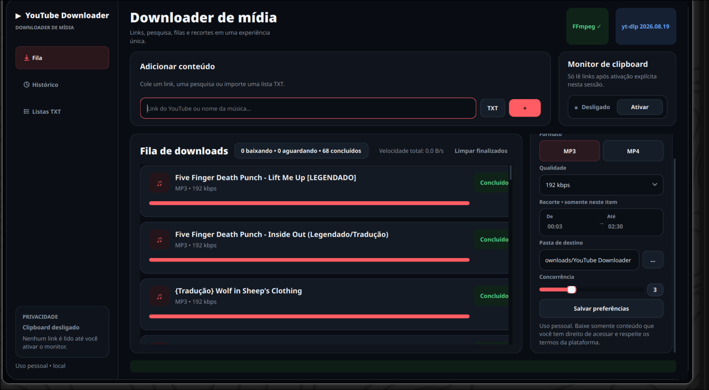
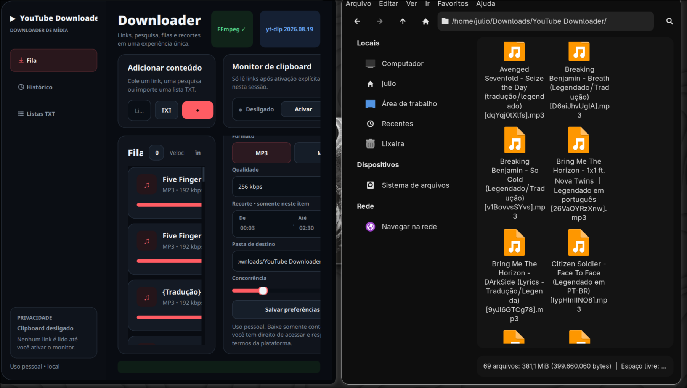
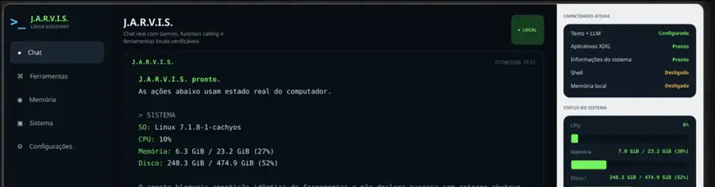

# Júlio Cézar

### Estudante de Ciência da Computação · Técnico em Desenvolvimento de Sistemas

Construindo experiência prática por meio de estudos, projetos acadêmicos e projetos pessoais.

---

## Sobre mim

Sou estudante de **Ciência da Computação** e formado como **Técnico em Desenvolvimento de Sistemas**.

Tenho interesse por diferentes partes do desenvolvimento de software e procuro aprender tanto os fundamentos da programação quanto desenvolvimento web, bancos de dados, Linux e ferramentas usadas no dia a dia de desenvolvimento.

Minha experiência prática vem principalmente de **projetos acadêmicos, estudos e projetos pessoais**. Meu objetivo é fortalecer os fundamentos, ganhar experiência e evoluir como desenvolvedor sem me limitar desde cedo a uma única área.

## Tecnologias com as quais tenho contato

  
  
  
  

  
  
  
  

  
  
  
  

> Essas tecnologias representam ferramentas com as quais já tive contato em estudos ou projetos. Continuo aprofundando meus conhecimentos e fundamentos em cada uma delas.

## Projetos em destaque

### 🎬 YouTube Downloader

Aplicação desktop pessoal para organizar downloads de mídia, com interface gráfica, fila, histórico, listas, formatos, qualidade e recorte por intervalo.

`Python` · `PySide6 / Qt` · `yt-dlp` · `FFmpeg`

   

<strong>Ver funcionamento na prática</strong>

 

  

O projeto tem sido usado como espaço de prática para **interfaces desktop, organização de código, tratamento de erros, concorrência, testes e integração com ferramentas externas**.

> O repositório está em preparação para publicação. Quando a versão pública estiver disponível, o link será adicionado aqui.

---

### 🏠 Residencial Rosileide

Projeto web de gestão residencial usado para centralizar **imóveis, locatários, contratos, cobranças, pagamentos e recibos** em uma única aplicação.

`Next.js` · `React` · `TypeScript` · `Node.js` · `PostgreSQL` · `Docker`

  

<strong>Ver portal do locatário</strong>

 

  

O projeto tem sido uma forma de praticar **desenvolvimento web, integração entre frontend e backend, bancos de dados e organização de fluxos reais de uma aplicação**.

> Projeto comercial com código-fonte e infraestrutura privados. As capturas usadas no perfil são reais e foram sanitizadas para não expor dados de locatários.

---

### 🖥️ J.A.R.V.I.S.

Assistente desktop para Linux criado como projeto pessoal para praticar **Python, interfaces gráficas, integração com ferramentas locais do sistema e modelos de linguagem**.

`Python` · `PySide6 / Qt` · `SQLite` · `Linux` · `Gemini`

  

O projeto tem sido usado para explorar **interfaces desktop, informações do sistema, ferramentas locais, persistência opcional em SQLite e integração com serviços externos**.

> Projeto pessoal privado e em evolução. A imagem acima é uma captura real da interface em execução no Linux.

## Projetos e prática

### 🎓 Projetos acadêmicos

No repositório [**Faculdade**](https://github.com/Jczarf/Faculdade) mantenho exercícios e projetos desenvolvidos durante a graduação, incluindo atividades em **C** voltadas a lógica de programação, estruturas de controle, funções, recursividade e resolução de problemas.

### 🧩 Projetos pessoais

Também utilizo projetos próprios para praticar conteúdos estudados e experimentar conceitos de **aplicações web, APIs, bancos de dados, Linux e organização de ambientes de desenvolvimento**.

Alguns desses projetos são privados ou experimentais e têm como foco principal estudo e evolução técnica.

## Atualmente estudando

`Fundamentos de Computação` · `Desenvolvimento de Software` · `Web e APIs` · `Bancos de Dados` · `Git/GitHub` · `Linux e Containers`

---

**Sempre aprendendo, construindo e melhorando um passo de cada vez.**

[LinkedIn](https://www.linkedin.com/in/j%C3%BAlio-c%C3%A9zar-0a26152b2/) · [GitHub](https://github.com/Jczarf)

